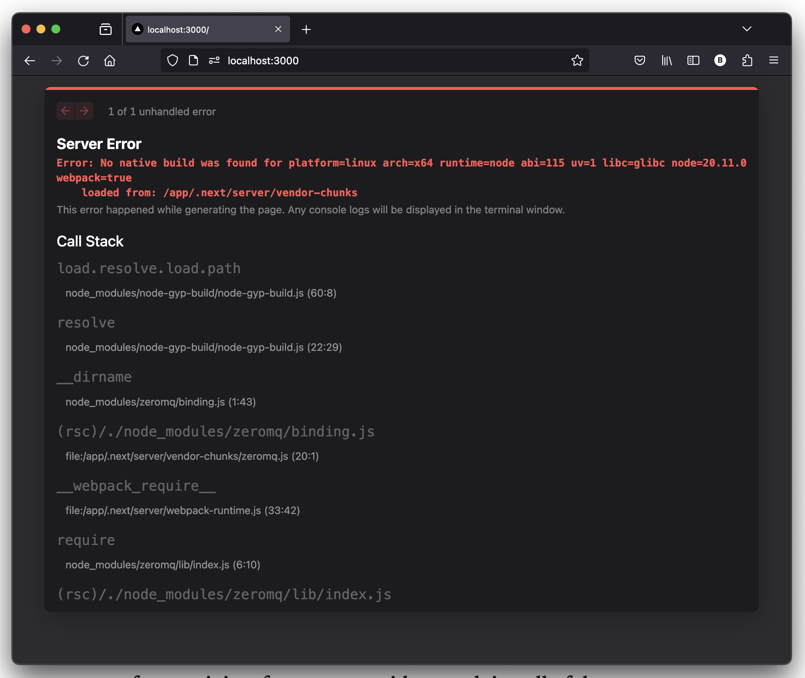

# zeromq.js failing on Next.js

This repository demonstrates the inability the TypeScript zeromq.js bindings on the
context of a Next.js application. I provide a reproducible docker container for
investigation.

## Environment

* **OS**: Debian GNU/Linux 12 (bookworm)
* **Node.js**: 20.11.0 (LTS)
* **Next.js**: 14.1.0
* **zeromq.js**: 6.0.0-beta.19

> [!NOTE]
> It also happens in macOS 14.1.1

## Reproduction Steps

### Manually

Basically create a next app `npx create-next-app@latest` with all the defaults, install
zeromq `npm install zeromq@6.0.0-beta.19`, import it anywhere in `app/page.tsx` (e.g.
`import { Push } from "zeromq";` and `const sock = new Push();` anywhere in your file),
start the development server `npm run dev` and visit `http://localhost:3000`.

### Reproducible Container

1. Clone this repository `git@github.com:eulersson/zeromq.js-node.js-errors.git`
2. Build the Debian Docker container provided `docker build -t zeromq-nextjs`
3. Run the Next.js development server container `docker run --rm -it -p 3000:3000 nextjs-zeromq`
4. Visit `http://localhost:3000` on your host browser.

- **Result**: Many "No native build was found for" errors server logs and an error screen on the browser.
- **Should**: Not error.



Maybe it's related to the way Next.js compiles the pacakges?

> [!NOTE]
> The `zeromq@5` package fails too (if you try installing it you need to
> `apt-get update && apt-get install python make cmake g++` first).

## Error Log

```
root@3ae29fabb9db:/app# npm run dev

> my-app@0.1.0 dev
> next dev

   ▲ Next.js 14.1.0
   - Local:        http://localhost:3000

 ✓ Ready in 2.3s
 ○ Compiling /not-found ...

warn - No utility classes were detected in your source files. If this is unexpected, double-check the `content` option in your Tailwind CSS configuration.
warn - https://tailwindcss.com/docs/content-configuration
 ✓ Compiled / in 7.3s (471 modules)
Error: No native build was found for platform=linux arch=x64 runtime=node abi=115 uv=1 libc=glibc node=20.11.0 webpack=true
    loaded from: /app/.next/server

    at load.path (webpack-internal:///(rsc)/./node_modules/@aminya/node-gyp-build/index.js:50:11)
    at load (webpack-internal:///(rsc)/./node_modules/@aminya/node-gyp-build/index.js:20:32)
    at eval (webpack-internal:///(rsc)/./node_modules/zeromq/lib/native.js:6:123)
    at (rsc)/./node_modules/zeromq/lib/native.js (/app/.next/server/vendor-chunks/zeromq.js:40:1)
    at __webpack_require__ (/app/.next/server/webpack-runtime.js:33:42)
    at eval (webpack-internal:///(rsc)/./node_modules/zeromq/lib/index.js:7:16)
    at (rsc)/./node_modules/zeromq/lib/index.js (/app/.next/server/vendor-chunks/zeromq.js:30:1)
    at __webpack_require__ (/app/.next/server/webpack-runtime.js:33:42)
    at eval (webpack-internal:///(rsc)/./app/page.tsx:7:64)
    at (rsc)/./app/page.tsx (/app/.next/server/app/page.js:217:1)
    at Function.__webpack_require__ (/app/.next/server/webpack-runtime.js:33:42)
    at async eq (/app/node_modules/next/dist/compiled/next-server/app-page.runtime.dev.js:35:402260)
    at async tr (/app/node_modules/next/dist/compiled/next-server/app-page.runtime.dev.js:35:405987)
    at async tn (/app/node_modules/next/dist/compiled/next-server/app-page.runtime.dev.js:35:406537)
    at async tn (/app/node_modules/next/dist/compiled/next-server/app-page.runtime.dev.js:35:406668)
    at async tu (/app/node_modules/next/dist/compiled/next-server/app-page.runtime.dev.js:36:2057)
    at async /app/node_modules/next/dist/compiled/next-server/app-page.runtime.dev.js:36:2564 {
  digest: '3408682970'
}
 ⨯ node_modules/@aminya/node-gyp-build/index.js (60:8) @ load.path
 ⨯ Error: No native build was found for platform=linux arch=x64 runtime=node abi=115 uv=1 libc=glibc node=20.11.0 webpack=true
    loaded from: /app/.next/server

    at __webpack_require__ (/app/.next/server/webpack-runtime.js:33:42)
    at __webpack_require__ (/app/.next/server/webpack-runtime.js:33:42)
    at eval (./app/page.tsx:7:64)
    at (rsc)/./app/page.tsx (/app/.next/server/app/page.js:217:1)
    at Function.__webpack_require__ (/app/.next/server/webpack-runtime.js:33:42)
    at async Promise.all (index 0)
null
 ⨯ node_modules/@aminya/node-gyp-build/index.js (60:8) @ load.path
 ⨯ Error: No native build was found for platform=linux arch=x64 runtime=node abi=115 uv=1 libc=glibc node=20.11.0 webpack=true
    loaded from: /app/.next/server

    at __webpack_require__ (/app/.next/server/webpack-runtime.js:33:42)
    at __webpack_require__ (/app/.next/server/webpack-runtime.js:33:42)
    at eval (./app/page.tsx:7:64)
    at (rsc)/./app/page.tsx (/app/.next/server/app/page.js:217:1)
    at Function.__webpack_require__ (/app/.next/server/webpack-runtime.js:33:42)
    at async Promise.all (index 0)
digest: "1453847562"
null
 ⨯ node_modules/@aminya/node-gyp-build/index.js (60:8) @ load.path
 ⨯ Error: No native build was found for platform=linux arch=x64 runtime=node abi=115 uv=1 libc=glibc node=20.11.0 webpack=true
    loaded from: /app/.next/server

    at __webpack_require__ (/app/.next/server/webpack-runtime.js:33:42)
    at __webpack_require__ (/app/.next/server/webpack-runtime.js:33:42)
    at eval (./app/page.tsx:7:64)
    at (rsc)/./app/page.tsx (/app/.next/server/app/page.js:217:1)
    at Function.__webpack_require__ (/app/.next/server/webpack-runtime.js:33:42)
null
 ⨯ node_modules/@aminya/node-gyp-build/index.js (60:8) @ load.path
 ⨯ Error: No native build was found for platform=linux arch=x64 runtime=node abi=115 uv=1 libc=glibc node=20.11.0 webpack=true
    loaded from: /app/.next/server

    at load.path (webpack-internal:///(rsc)/./node_modules/@aminya/node-gyp-build/index.js:50:11)
    at load (webpack-internal:///(rsc)/./node_modules/@aminya/node-gyp-build/index.js:20:32)
    at eval (webpack-internal:///(rsc)/./node_modules/zeromq/lib/native.js:6:123)
    at (rsc)/./node_modules/zeromq/lib/native.js (/app/.next/server/vendor-chunks/zeromq.js:40:1)
    at __webpack_require__ (/app/.next/server/webpack-runtime.js:33:42)
    at eval (webpack-internal:///(rsc)/./node_modules/zeromq/lib/index.js:7:16)
    at (rsc)/./node_modules/zeromq/lib/index.js (/app/.next/server/vendor-chunks/zeromq.js:30:1)
    at __webpack_require__ (/app/.next/server/webpack-runtime.js:33:42)
    at eval (webpack-internal:///(rsc)/./app/page.tsx:7:64)
    at (rsc)/./app/page.tsx (/app/.next/server/app/page.js:217:1)
    at Function.__webpack_require__ (/app/.next/server/webpack-runtime.js:33:42)
    at async eq (/app/node_modules/next/dist/compiled/next-server/app-page.runtime.dev.js:35:402260)
    at async tr (/app/node_modules/next/dist/compiled/next-server/app-page.runtime.dev.js:35:405987)
    at async tn (/app/node_modules/next/dist/compiled/next-server/app-page.runtime.dev.js:35:406537)
    at async tn (/app/node_modules/next/dist/compiled/next-server/app-page.runtime.dev.js:35:406668)
    at async tu (/app/node_modules/next/dist/compiled/next-server/app-page.runtime.dev.js:36:2057)
    at async /app/node_modules/next/dist/compiled/next-server/app-page.runtime.dev.js:36:2564 {
  digest: '3408682970',
  page: '/'
}
null
 ⨯ node_modules/@aminya/node-gyp-build/index.js (60:8) @ load.path
 ⨯ Error: No native build was found for platform=linux arch=x64 runtime=node abi=115 uv=1 libc=glibc node=20.11.0 webpack=true
    loaded from: /app/.next/server

    at __webpack_require__ (/app/.next/server/webpack-runtime.js:33:42)
    at __webpack_require__ (/app/.next/server/webpack-runtime.js:33:42)
    at eval (./app/page.tsx:7:64)
    at (rsc)/./app/page.tsx (/app/.next/server/app/page.js:217:1)
    at Function.__webpack_require__ (/app/.next/server/webpack-runtime.js:33:42)
    at async Promise.all (index 0)
null
 ⨯ node_modules/@aminya/node-gyp-build/index.js (60:8) @ load.path
 ⨯ Error: No native build was found for platform=linux arch=x64 runtime=node abi=115 uv=1 libc=glibc node=20.11.0 webpack=true
    loaded from: /app/.next/server

    at __webpack_require__ (/app/.next/server/webpack-runtime.js:33:42)
    at __webpack_require__ (/app/.next/server/webpack-runtime.js:33:42)
    at eval (./app/page.tsx:7:64)
    at (rsc)/./app/page.tsx (/app/.next/server/app/page.js:217:1)
    at Function.__webpack_require__ (/app/.next/server/webpack-runtime.js:33:42)
    at async Promise.all (index 0)
digest: "2342305956"
null
 ⨯ node_modules/@aminya/node-gyp-build/index.js (60:8) @ load.path
 ⨯ Error: No native build was found for platform=linux arch=x64 runtime=node abi=115 uv=1 libc=glibc node=20.11.0 webpack=true
    loaded from: /app/.next/server

    at __webpack_require__ (/app/.next/server/webpack-runtime.js:33:42)
    at __webpack_require__ (/app/.next/server/webpack-runtime.js:33:42)
    at eval (./app/page.tsx:7:64)
    at (rsc)/./app/page.tsx (/app/.next/server/app/page.js:217:1)
    at Function.__webpack_require__ (/app/.next/server/webpack-runtime.js:33:42)
null
Error: No native build was found for platform=linux arch=x64 runtime=node abi=115 uv=1 libc=glibc node=20.11.0 webpack=true
    loaded from: /app/.next/server

    at load.path (webpack-internal:///(rsc)/./node_modules/@aminya/node-gyp-build/index.js:50:11)
    at load (webpack-internal:///(rsc)/./node_modules/@aminya/node-gyp-build/index.js:20:32)
    at eval (webpack-internal:///(rsc)/./node_modules/zeromq/lib/native.js:6:123)
    at (rsc)/./node_modules/zeromq/lib/native.js (/app/.next/server/vendor-chunks/zeromq.js:40:1)
    at __webpack_require__ (/app/.next/server/webpack-runtime.js:33:42)
    at eval (webpack-internal:///(rsc)/./node_modules/zeromq/lib/index.js:7:16)
    at (rsc)/./node_modules/zeromq/lib/index.js (/app/.next/server/vendor-chunks/zeromq.js:30:1)
    at __webpack_require__ (/app/.next/server/webpack-runtime.js:33:42)
    at eval (webpack-internal:///(rsc)/./app/page.tsx:7:64)
    at (rsc)/./app/page.tsx (/app/.next/server/app/page.js:217:1)
    at Function.__webpack_require__ (/app/.next/server/webpack-runtime.js:33:42)
    at async eq (/app/node_modules/next/dist/compiled/next-server/app-page.runtime.dev.js:35:402260)
    at async tr (/app/node_modules/next/dist/compiled/next-server/app-page.runtime.dev.js:35:405987)
    at async tn (/app/node_modules/next/dist/compiled/next-server/app-page.runtime.dev.js:35:406537)
    at async tn (/app/node_modules/next/dist/compiled/next-server/app-page.runtime.dev.js:35:406668)
    at async tu (/app/node_modules/next/dist/compiled/next-server/app-page.runtime.dev.js:36:2057)
    at async /app/node_modules/next/dist/compiled/next-server/app-page.runtime.dev.js:36:2564 {
  digest: '3408682970'
}
 ⨯ node_modules/@aminya/node-gyp-build/index.js (60:8) @ load.path
 ⨯ Error: No native build was found for platform=linux arch=x64 runtime=node abi=115 uv=1 libc=glibc node=20.11.0 webpack=true
    loaded from: /app/.next/server

    at load.path (webpack-internal:///(rsc)/./node_modules/@aminya/node-gyp-build/index.js:50:11)
    at load (webpack-internal:///(rsc)/./node_modules/@aminya/node-gyp-build/index.js:20:32)
    at eval (webpack-internal:///(rsc)/./node_modules/zeromq/lib/native.js:6:123)
    at (rsc)/./node_modules/zeromq/lib/native.js (/app/.next/server/vendor-chunks/zeromq.js:40:1)
    at __webpack_require__ (/app/.next/server/webpack-runtime.js:33:42)
    at eval (webpack-internal:///(rsc)/./node_modules/zeromq/lib/index.js:7:16)
    at (rsc)/./node_modules/zeromq/lib/index.js (/app/.next/server/vendor-chunks/zeromq.js:30:1)
    at __webpack_require__ (/app/.next/server/webpack-runtime.js:33:42)
    at eval (webpack-internal:///(rsc)/./app/page.tsx:7:64)
    at (rsc)/./app/page.tsx (/app/.next/server/app/page.js:217:1)
    at Function.__webpack_require__ (/app/.next/server/webpack-runtime.js:33:42)
    at async eq (/app/node_modules/next/dist/compiled/next-server/app-page.runtime.dev.js:35:402260)
    at async tr (/app/node_modules/next/dist/compiled/next-server/app-page.runtime.dev.js:35:405987)
    at async tn (/app/node_modules/next/dist/compiled/next-server/app-page.runtime.dev.js:35:406537)
    at async tn (/app/node_modules/next/dist/compiled/next-server/app-page.runtime.dev.js:35:406668)
    at async tu (/app/node_modules/next/dist/compiled/next-server/app-page.runtime.dev.js:36:2057)
    at async /app/node_modules/next/dist/compiled/next-server/app-page.runtime.dev.js:36:2564 {
  digest: '3408682970',
  page: '/'
}
null
 ○ Compiling /_error ...
 ✓ Compiled /_error in 1397ms (619 modules)
 ⨯ node_modules/@aminya/node-gyp-build/index.js (60:8) @ load.path
 ⨯ Error: No native build was found for platform=linux arch=x64 runtime=node abi=115 uv=1 libc=glibc node=20.11.0 webpack=true
    loaded from: /app/.next/server

    at __webpack_require__ (/app/.next/server/webpack-runtime.js:33:42)
    at __webpack_require__ (/app/.next/server/webpack-runtime.js:33:42)
    at eval (./app/page.tsx:7:64)
    at (rsc)/./app/page.tsx (/app/.next/server/app/page.js:217:1)
    at Function.__webpack_require__ (/app/.next/server/webpack-runtime.js:33:42)
    at async Promise.all (index 0)
null
 ⨯ node_modules/@aminya/node-gyp-build/index.js (60:8) @ load.path
 ⨯ Error: No native build was found for platform=linux arch=x64 runtime=node abi=115 uv=1 libc=glibc node=20.11.0 webpack=true
    loaded from: /app/.next/server

    at __webpack_require__ (/app/.next/server/webpack-runtime.js:33:42)
    at __webpack_require__ (/app/.next/server/webpack-runtime.js:33:42)
    at eval (./app/page.tsx:7:64)
    at (rsc)/./app/page.tsx (/app/.next/server/app/page.js:217:1)
    at Function.__webpack_require__ (/app/.next/server/webpack-runtime.js:33:42)
    at async Promise.all (index 0)
digest: "2342305956"
null
 ⨯ node_modules/@aminya/node-gyp-build/index.js (60:8) @ load.path
 ⨯ Error: No native build was found for platform=linux arch=x64 runtime=node abi=115 uv=1 libc=glibc node=20.11.0 webpack=true
    loaded from: /app/.next/server

    at __webpack_require__ (/app/.next/server/webpack-runtime.js:33:42)
    at __webpack_require__ (/app/.next/server/webpack-runtime.js:33:42)
    at eval (./app/page.tsx:7:64)
    at (rsc)/./app/page.tsx (/app/.next/server/app/page.js:217:1)
    at Function.__webpack_require__ (/app/.next/server/webpack-runtime.js:33:42)
null
Error: No native build was found for platform=linux arch=x64 runtime=node abi=115 uv=1 libc=glibc node=20.11.0 webpack=true
    loaded from: /app/.next/server

    at load.path (webpack-internal:///(rsc)/./node_modules/@aminya/node-gyp-build/index.js:50:11)
    at load (webpack-internal:///(rsc)/./node_modules/@aminya/node-gyp-build/index.js:20:32)
    at eval (webpack-internal:///(rsc)/./node_modules/zeromq/lib/native.js:6:123)
    at (rsc)/./node_modules/zeromq/lib/native.js (/app/.next/server/vendor-chunks/zeromq.js:40:1)
    at __webpack_require__ (/app/.next/server/webpack-runtime.js:33:42)
    at eval (webpack-internal:///(rsc)/./node_modules/zeromq/lib/index.js:7:16)
    at (rsc)/./node_modules/zeromq/lib/index.js (/app/.next/server/vendor-chunks/zeromq.js:30:1)
    at __webpack_require__ (/app/.next/server/webpack-runtime.js:33:42)
    at eval (webpack-internal:///(rsc)/./app/page.tsx:7:64)
    at (rsc)/./app/page.tsx (/app/.next/server/app/page.js:217:1)
    at Function.__webpack_require__ (/app/.next/server/webpack-runtime.js:33:42)
    at async eq (/app/node_modules/next/dist/compiled/next-server/app-page.runtime.dev.js:35:402260)
    at async tr (/app/node_modules/next/dist/compiled/next-server/app-page.runtime.dev.js:35:405987)
    at async tn (/app/node_modules/next/dist/compiled/next-server/app-page.runtime.dev.js:35:406537)
    at async tn (/app/node_modules/next/dist/compiled/next-server/app-page.runtime.dev.js:35:406668)
    at async tu (/app/node_modules/next/dist/compiled/next-server/app-page.runtime.dev.js:36:2057)
    at async /app/node_modules/next/dist/compiled/next-server/app-page.runtime.dev.js:36:2564 {
  digest: '3408682970'
}
 ⨯ node_modules/@aminya/node-gyp-build/index.js (60:8) @ load.path
 ⨯ Error: No native build was found for platform=linux arch=x64 runtime=node abi=115 uv=1 libc=glibc node=20.11.0 webpack=true
    loaded from: /app/.next/server

    at load.path (webpack-internal:///(rsc)/./node_modules/@aminya/node-gyp-build/index.js:50:11)
    at load (webpack-internal:///(rsc)/./node_modules/@aminya/node-gyp-build/index.js:20:32)
    at eval (webpack-internal:///(rsc)/./node_modules/zeromq/lib/native.js:6:123)
    at (rsc)/./node_modules/zeromq/lib/native.js (/app/.next/server/vendor-chunks/zeromq.js:40:1)
    at __webpack_require__ (/app/.next/server/webpack-runtime.js:33:42)
    at eval (webpack-internal:///(rsc)/./node_modules/zeromq/lib/index.js:7:16)
    at (rsc)/./node_modules/zeromq/lib/index.js (/app/.next/server/vendor-chunks/zeromq.js:30:1)
    at __webpack_require__ (/app/.next/server/webpack-runtime.js:33:42)
    at eval (webpack-internal:///(rsc)/./app/page.tsx:7:64)
    at (rsc)/./app/page.tsx (/app/.next/server/app/page.js:217:1)
    at Function.__webpack_require__ (/app/.next/server/webpack-runtime.js:33:42)
    at async eq (/app/node_modules/next/dist/compiled/next-server/app-page.runtime.dev.js:35:402260)
    at async tr (/app/node_modules/next/dist/compiled/next-server/app-page.runtime.dev.js:35:405987)
    at async tn (/app/node_modules/next/dist/compiled/next-server/app-page.runtime.dev.js:35:406537)
    at async tn (/app/node_modules/next/dist/compiled/next-server/app-page.runtime.dev.js:35:406668)
    at async tu (/app/node_modules/next/dist/compiled/next-server/app-page.runtime.dev.js:36:2057)
    at async /app/node_modules/next/dist/compiled/next-server/app-page.runtime.dev.js:36:2564 {
  digest: '3408682970',
  page: '/'
}
null
```